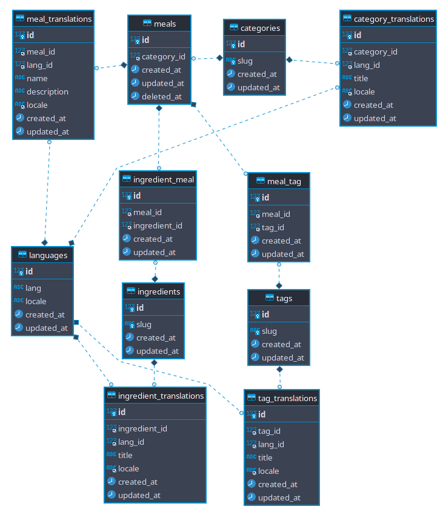

## World Dishes Api 

Dishes of the world api.
Simple api that only gets a collection of requested data.

#### Used packages
[`fzaninotto/faker`](https://github.com/fzaninotto/Faker): PHP library that generates fake data 
[`jzonta/faker-restaurant`](https://github.com/jzonta/FakerRestaurant): Faker for Food and Beverage names generate 
[`Astrotomic/laravel-translatable`](https://github.com/Astrotomic/laravel-translatable): Laravel package for translatable models 

#### Database

#### Models
Models: `Category, Tag, Ingredient, Meal, Language` 
Translation models: `CategoryTranslation, TagTranslation, IngredientTranslation, MealTranslation` 
Pivot models: `MealTag, TagIngredient` 

#### Resources
Json resources: `CategoryResource, TagResource, IngredientResource, MealResource` 
Resource collection: `MealCollection`

#### Events
Deleting events on pivot models `MealTag, TagIngredient`. Triggers on detach.

#### Observers 
`IngredientObserver, TagObserver` - observe on deleting, if connected meal data doesn't contain any tags or ingredients delete meal data. 
`MealObserver` - observe on update, restore. Check if meal contains ingredients or tags, if not delete meal data.

#### Controller
`ApiMealController` - contains `index` function that returns requested data.

#### Route
`meals.index` - connected with `ApiMealController` uses function `index`.

#### Factories
`CategoryFactory, TagFactory, IngredientFactory` 
`MealFactory` - available states: `modified, deleted, category_null`.

#### Seeder
`LanguageSeeder` - seeds languages table with language and locale.
